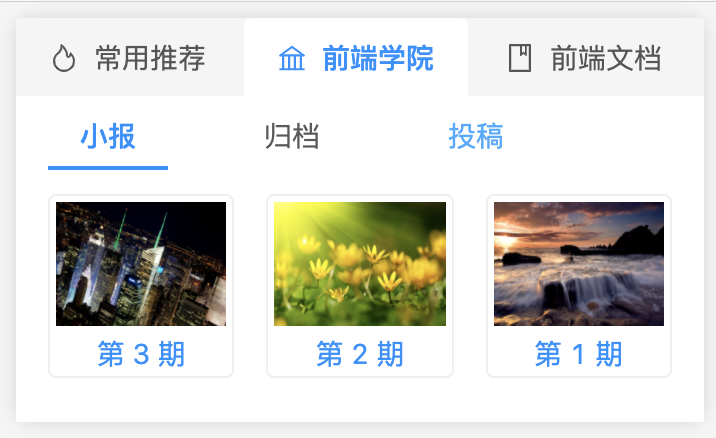
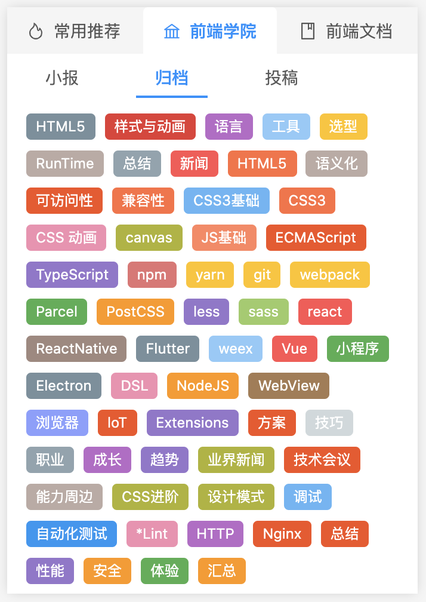
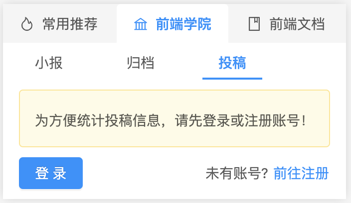
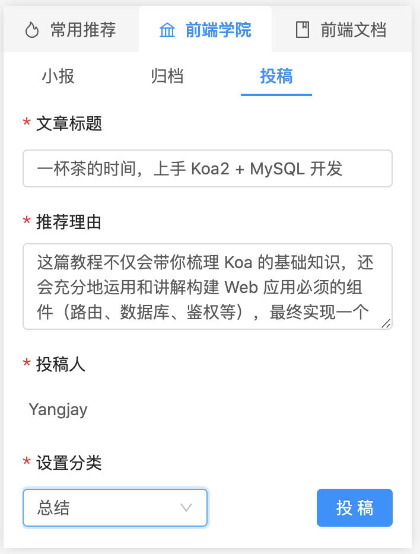

<h2 align="center"> Fe-Weekly-Extension </h2>

如浏览器书签收藏文章一样方便的投稿文章的插件

## 项目背景

💡项目想法来源于掘金上的一篇文章：

> [手把手教你打造属于自己团队的前端小报系统](https://juejin.im/post/6854573219895050247#heading-10) - [ 政采云前端团队 ]

源代码没有开源，不过开发难度不大，大家可按照文章中的思路、架构设计进行开发


## 主要功能

#### 小报汇总


| instructions | Preview |
| -------| ------------------ | 
| `每周五会对本周的所有投稿进行汇总，并通过注册邮箱发送到团队成员` |  | 

#### 标签汇总

| instructions | Preview |
| -------| ------------------ | 
| `通过标签对所有投稿进行汇总，分类沉淀，打造团队的知识库` |  | 

#### 登录注册

| instructions | Preview |
| -------| ------------------ | 
| `为方便投稿信息统计以及每周小报推送，需注册账号` |  | 


#### 一键投稿

| instructions | Preview |
| -------| ------------------ | 
| `自动识别文章标题，轻松分享，一键投稿` |  | 


## 本地运行

本项目仅是客户端，也就是Chrome插件，后端服务由 [lego-weekly-server](https://github.com/lego-weekly/lego-weekly-server) 项目提供（ps: 本地二次开发，两个项目都需要下载）

1. 下载到本地 

```shell
git clone git@github.com:lego-weekly/lego-weekly-extension.git
```

2. 安装依赖 

```shell
yarn || npm i
```

3. 运行项目 

```shell
yarn serve || npm run serve
```

4. 打开Chrome 浏览器扩展程序[chrome://extensions/] -> 开启开发者模式 -> 加载已解压的扩展程序

> PS：
> 运行项目时，需要在 `src/config.js` 中配置请求的服务地址，

## 开发环境及第三方框架

- 开发环境:

  - macOS 10.15.3
  - node "v14.2.0"

- 第三方框架
  - [vue-chrome-extension-template](https://github.com/YuraDev/vue-chrome-extension-template)， vue 开发 chrome 插件模板
  

## TODO

**计划中**

- [ ] 常用推荐、前端文档功能开发
- [ ] ...


## License

[MIT](http://opensource.org/licenses/MIT) License - Copyright (c) 2020 yangjay。